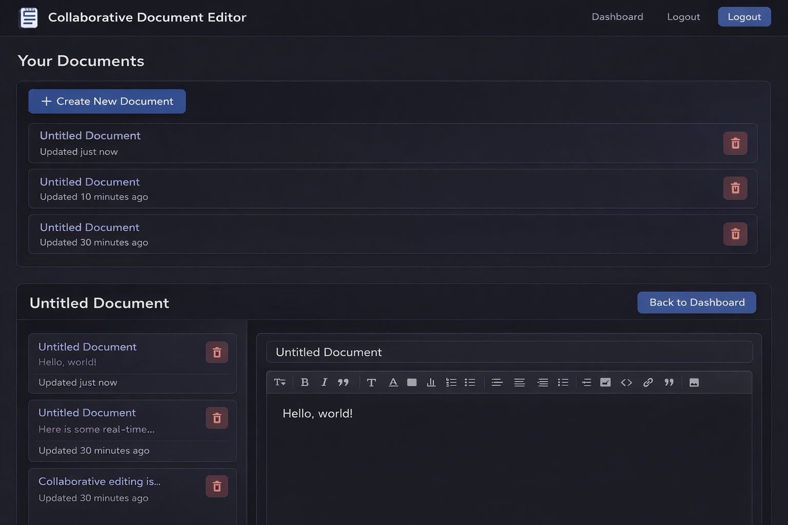

<h1 align="center">🚀 Collaborative Document Editor</h1>

<p align="center">
  Real-time collaborative editor built with MERN + Socket.io
</p>

<p align="center">
  
  
  
  
</p>

---

## 📸 Screenshots

<p align="center">
  
</p>

---

## ✨ Features

- 🔐 Secure Authentication (JWT)
- ⚡ Real-time document editing (Socket.io)
- 📄 Create, edit, and manage documents
- 🛡 Protected routes
- 🌙 Clean modern UI

---

## 🧠 What I Learned

- Handling real-time communication using WebSockets  
- Fixing authentication issues (401 errors 🔥)  
- Structuring a scalable MERN application  
- Managing state synchronization  

---

## 🛠 Tech Stack

| Layer      | Technology |
|-----------|------------|
| Frontend  | React |
| Backend   | Node.js, Express |
| Database  | MongoDB |
| Realtime  | Socket.io |

---

## ⚙️ Installation

### 1️⃣ Clone the repository
```bash
git clone https://github.com/dhanendiran/collaborative-doc-editor.git
